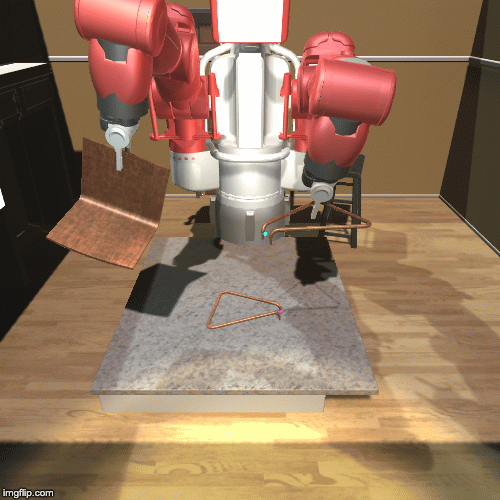

# Configuration

We offer many configuration options on both the MuJoCo simulation and Unity rendering. The simulation configurations will be exposed through command line arguments.

## Robots
To switch between agent configuration, simply select the corresponding python script.
```
# sawyer
$ python -m env.furniture_sawyer ...

# cursor
$ python -m env.furniture_cursor ...
```
OR use the demo_\<yourtask\>.py script for your task
  ```
# manipulating agent manually
$ python -m demo_manual ...

# RL training
$ python -m demo_rl ...
```

## Furniture Models
Preferably use the `--furniture_name` argument to choose a furniture model. `--furniture_id` may also be used but is not recommended, because the ids are determined dynamically by sorting the xml files in the directory. Therefore, if more furniture is added, the IDs may change. Use the `furniture_name` argument to get the exact furniture you want. See [`furniture/env/models/__init__.py`](../env/models/__init__.py) for more details.

Some furniture pieces (e.g. flat plane) are difficult to grasp using grippers we currently support.
This can be addressed by initializing the difficult parts in a predefined, easy to grasp way. See
[Designing a new task](creating_task.md) for how to customize initialization.

## Assembly Configuration
Two parts will be assembled when an agent activates `connect` action and two parts are well-aligned.
The thresholds for determining successful connection are defined by distance between two connectors `pos_dist`, cosine distance between up vectors of connectors `rot_dist_up`, cosine distance between forward vectors of connectors `rot_dist_forward`, and relative pose of two connectors `project_dist`. These values are configurable by changing those values in [`furniture/env/furniture.py`](../env/furniture.py). Please refer to `_is_aligned(connector1, connector2)` method in [`furniture/env/furniture.py`](../env/furniture.py) for details.

## Background Scenes



Use `--background` argument to choose a background scene.

- Garage: flat ground environment
- Interior: flat ground, interior decoration
- Lab: flat ground, bright lighting
- Industrial: cluttered objects, directional lighting
- NightTime: flat ground, dim lighting
- Ambient: flat ground, colored lighting

The next update will make lighting and material changes programmatic, so the user does not need to rebuild the binary for Unity changes.
Note that objects in the Unity scene are not physically simulated. For example, the table is just an overlay of the invisible mujoco ground plane.


