# Configuration

We offer many configuration options on both the MuJoCo simulation and Unity rendering. The simulation configurations will be exposed through command line arguments.

## Robots
To switch between agent configuration, simply select the corresponding python script.
```
# sawyer
$ python -m env.furniture_sawyer ...

# baxter
$ python -m env.furniture_baxter ...

# cursor
$ python -m env.furniture_cursor ...
```

## Furniture Models
Use `--furniture_name` or `--furniture_id` argument to choose a furniture model. The ids are determined dynamically by sorting the xml files in the directory. Therefore, if you add additional furniture, the IDs may change. Use the `furniture_name` argument to get the exact furniture you want. See [`furniture/env/models/__init__.py`](../env/models/__init__.py) for more details.

Some furniture pieces (e.g. flat plane) are difficult to grasp using grippers we currently support.
This can be addressed by initializing the difficult parts in a predefined, easy to grasp way. See
[Designing a new task](creating_task.md) for how to customize initialization.

|ID|Furniture Name 		 |# of Parts| Notes      			      | Image                                                     |
| :---:| :---         		 |     :---:|      :--- 			      | :---:											                                |
|0     |block   					 |2  			  |toy example	|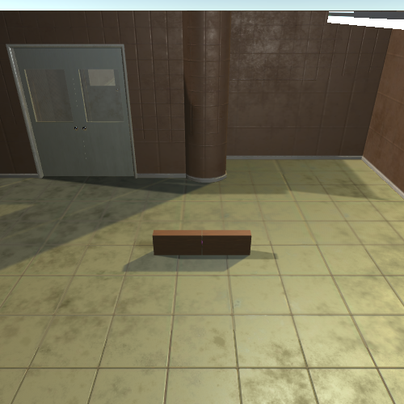              |
|1     |chair_agne_0007     |3  			  |seat not grippable 	  |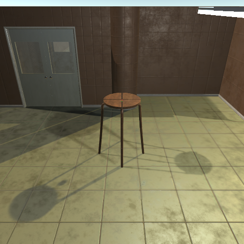     |
|2		 |chair_bernhard_0146|3  			  |						            |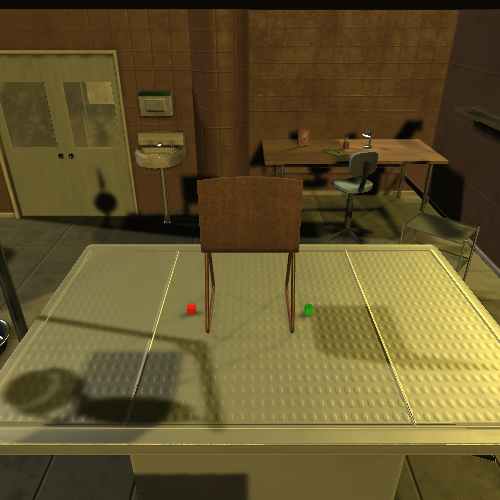|
|3		 |chair_bertil_0148  |5        |seat not grippable |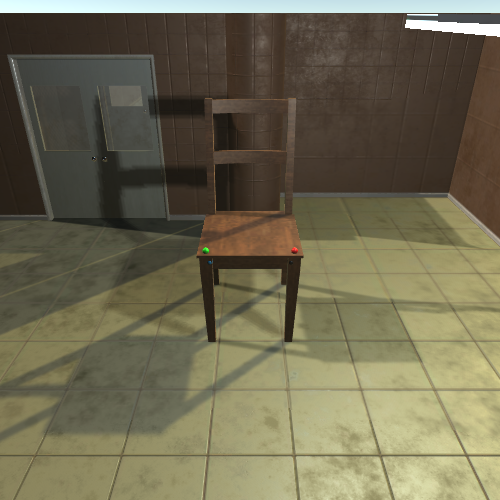	|
|4		 |desk_mikael_1064   |4  			  |table top not grippable|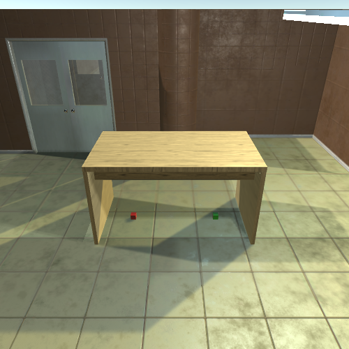   |
|5		 |shelf_ivar_0678    |6  			  |   				          	|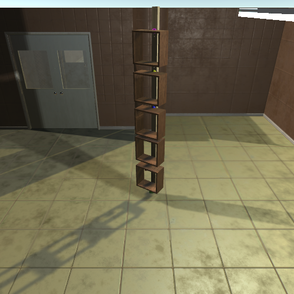    |
|6		 |shelf_liden_0922   |11  			|flat planes not grippable   	|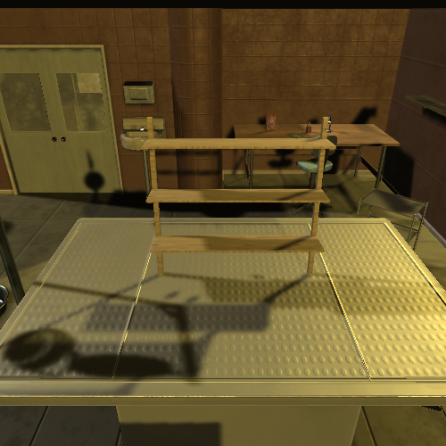   |
|7		 |swivel_chair_0700  |3  			  |    					          |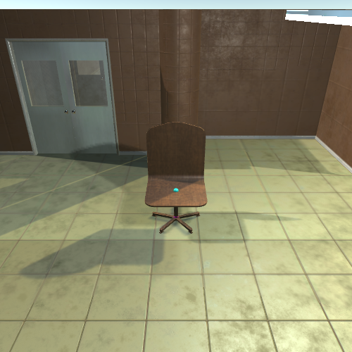  |
|8		 |table_klubbo_0743  |5  			  |             					|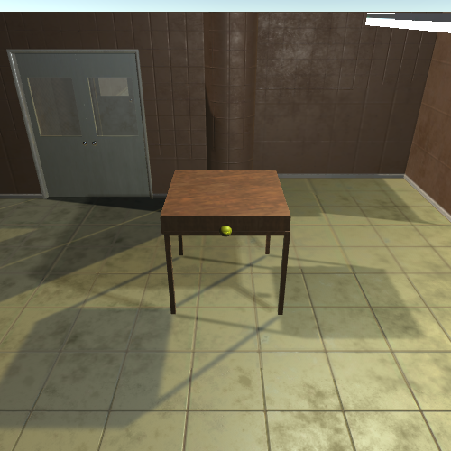  |
|9		 |table_lack_0825    |5  			  |              				  |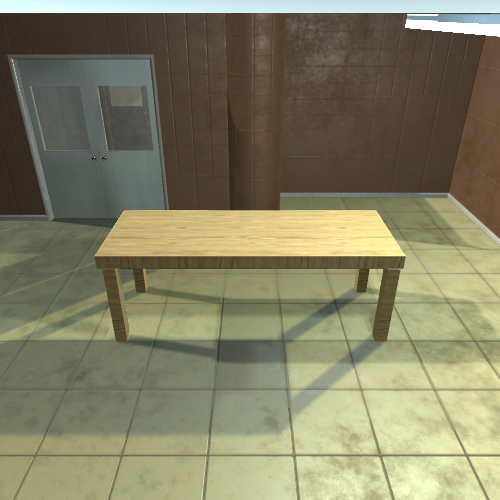    |
|10	   |tvunit_0406   		 |5 			  |flat planes not grippable|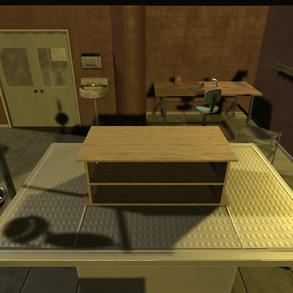        |


## Assembly Configuration
Two parts will be assembled when an agent activates `connect` action and two parts are well-aligned.
The thresholds for determining successful connection are defined by distance between two connectors `pos_dist`, cosine distance between up vectors of connectors `rot_dist_up`, cosine distance between forward vectors of connectors `rot_dist_forward`, and relative pose of two connectors `project_dist`. These values are configurable by changing those values in [`furniture/env/furniture.py`](../env/furniture.py). Please refer to `_is_aligned(connector1, connector2)` method in [`furniture/env/furniture.py`](../env/furniture.py) for details.

## Background Scenes


Use `--background` argument to choose a background scene.

- Garage: flat ground environment
- Interior: flat ground, interior decoration
- Lab: flat ground, bright lighting
- Industrial: cluttered objects, directional lighting
- NightTime: flat ground, dim lighting
- Ambient: flat ground, colored lighting

The next update will make lighting and material changes programatic, so the user does not need to rebuild the binary for Unity changes.
