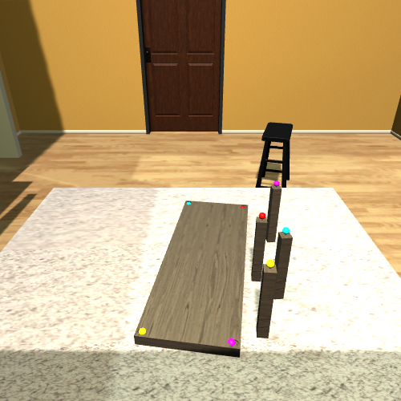

# Converting a New Furniture Model

The IKEA Furniture Assembly Environment implements a furniture model using MuJoCo XML schema and STL meshes for furniture pieces.
To create a new furniture model for the environment, a STL mesh for each furniture piece is required.
Then, we define the relative pose of all furniture parts in the MuJoCo XML together with connectors between two furniture parts and corner points of meshes. The tutorial for converting a new furniture model will be updated soon.


## Meshes
To use 3d meshes for collision detection, we reference the STL meshes for each part in the assets tag. Then we use mesh geoms for each body to give it a collider shaped like the mesh.
Many times, the mesh collider is not accurate enough for contact physics. So, we use the meshes for just rendering, and add invisible MuJoCo primitive geometries to create the colliders.

## Connectors, Welding
MuJoCo has a *weld* mechanism that can attach bodies together. We define weld constraints between parts that should be attached together in the equality tag.
The connectors on a part is defined through the site tag. There can be multiple connectors for each part. The naming for the connector is special, and should follow a template:
Given two parts A and B, we want to connect A to B:
The site tag for A should be named “A-B,conn_site” and the site tag for B should be “B-A,conn_site”.
Look at the XMLs in [`furniture/env/models/assets/objects`](../env/models/assets/objects) for more examples.

## Example

```xml
<mujoco model="chair_bernhard_0146">
    <asset>
        <mesh file="chair_bernhard_0146/complete_chair.stl" name="chair_complete" scale="0.576 0.576 0.576" />
        <mesh file="chair_bernhard_0146/left_leg.stl" name="1_chair_leg_left" scale="0.576 0.576 0.576" />
        <mesh file="chair_bernhard_0146/right_leg.stl" name="2_chair_leg_right" scale="0.576 0.576 0.576" />
        <mesh file="chair_bernhard_0146/seat.stl" name="3_chair_seat" scale="0.576 0.576 0.576" />
        <texture file="../textures/light-wood.png" name="tex-light-wood" type="2d" />
        <material name="light-wood" reflectance="0.5" texrepeat="20 20" texture="tex-light-wood" texuniform="true" />
    </asset>
    <equality>
      <weld active="false" body1="1_chair_leg_left" body2="3_chair_seat" solimp="1 1 0.5" solref="0.01 0.3" />
      <weld active="false" body1="2_chair_leg_right" body2="3_chair_seat" solimp="1 1 0.5" solref="0.01 0.3" />
    </equality>

    <worldbody>
        <body name="1_chair_leg_left" pos="-0.115 0.0 0.1727" quat="1 0 0 0">
            <geom density="100" material="light-wood" mesh="1_chair_leg_left" name="1_chair_leg_left_geom" pos="0 0 0" rgba="0.82 0.71 0.55 1" solref="0.001 1" type="mesh" />
            <site name="leg_left-seat,conn_site1" pos="0.0 0.0 0.1401" quat="0.707 0 -0.707 0" rgba="1 0 1 0.3" size="0.0057" />
            <site name="1_chair_leg_left_corner_site1" pos="-0.019 0.1305 -0.144" rgba="0 0 1 0.3" size="0.0057" />
            <site name="1_chair_leg_left_corner_site2" pos="-0.019 -0.129 -0.144" rgba="0 0 1 0.3" size="0.0057" />
            <site name="1_chair_leg_left_corner_site3" pos="0.0307 0.0230 0.1382" rgba="0 0 1 0.3" size="0.0057" />
            <site name="1_chair_leg_left_corner_site4" pos="0.0307 -0.022 0.1382" rgba="0 0 1 0.3" size="0.0057" />
            <site name="1_chair_leg_left_corner_site5" pos="-0.019 0.0230 0.1382" rgba="0 0 1 0.3" size="0.0057" />
            <site name="1_chair_leg_left_corner_site6" pos="-0.019 -0.022 0.1382" rgba="0 0 1 0.3" size="0.0057" />
            <site name="1_chair_leg_left_bottom_site" pos="-0.019 0.0 -0.134" rgba="0 0 1 0.3" size="0.0057" />
            <site name="1_chair_leg_left_top_site" pos="0.0 0.0 0.1382" rgba="0 0 1 0.3" size="0.0057" />
            <site name="1_chair_leg_left_horizontal_radius_site" pos="-0.019 0.0 0.0" rgba="0 0 1 0.3" size="0.0057" />
        </body>
        <body name="2_chair_leg_right" pos="0.1152 0.0 0.1727" quat="1 0 0 0">
            <geom density="100" material="light-wood" mesh="2_chair_leg_right" name="2_chair_leg_right_geom" pos="0 0 0" rgba="0.82 0.71 0.55 1" solref="0.001 1" type="mesh" />
            <site name="leg_right-seat,conn_site2" pos="0.0 0.0 0.1401" quat="0.707 0 -0.707 0" rgba="0 1 1 0.3" size="0.0057" />
            <site name="2_chair_leg_right_corner_site1" pos="0.0192 0.1305 -0.144" rgba="0 0 1 0.3" size="0.0057" />
            <site name="2_chair_leg_right_corner_site2" pos="0.0192 -0.129 -0.144" rgba="0 0 1 0.3" size="0.0057" />
            <site name="2_chair_leg_right_corner_site3" pos="0.0268 0.0230 0.1382" rgba="0 0 1 0.3" size="0.0057" />
            <site name="2_chair_leg_right_corner_site4" pos="0.0268 -0.022 0.1382" rgba="0 0 1 0.3" size="0.0057" />
            <site name="2_chair_leg_right_corner_site5" pos="-0.028 0.0230 0.1382" rgba="0 0 1 0.3" size="0.0057" />
            <site name="2_chair_leg_right_corner_site6" pos="-0.028 -0.022 0.1382" rgba="0 0 1 0.3" size="0.0057" />
            <site name="2_chair_leg_right_bottom_site" pos="0.0192 0.0 -0.134" rgba="0 0 1 0.3" size="0.0057" />
            <site name="2_chair_leg_right_top_site" pos="0.0 0.0 0.1382" rgba="0 0 1 0.3" size="0.0057" />
            <site name="2_chair_leg_right_horizontal_radius_site" pos="0.0172 0.0057 0.0" rgba="0 0 1 0.3" size="0.0057" />
        </body>
        <body name="3_chair_seat" pos="0.0 0.0 0.4416" quat="1 0 0 0">
            <geom density="100" material="light-wood" mesh="3_chair_seat" name="3_chair_seat_geom" pos="0 0 0" rgba="0.82 0.71 0.55 1" solref="0.001 1" type="mesh" />
            <site name="seat-leg_left,conn_site1" pos="-0.115 0.0 -0.126" quat="0.707 0 -0.707 0" rgba="1 0 1 0.3" size="0.0057" />
            <site name="seat-leg_right,conn_site2" pos="0.1152 0.0 -0.126" quat="0.707 0 -0.707 0" rgba="0 1 1 0.3" size="0.0057" />

            <site name="3_chair_seat_corner_site1" pos="0.1420 -0.116 0.1267" rgba="0 0 1 0.3" size="0.0057" />
            <site name="3_chair_seat_corner_site2" pos="0.0 -0.116 0.1267" rgba="0 0 1 0.3" size="0.0057" />
            <site name="3_chair_seat_corner_site3" pos="-0.141 -0.116 0.1267" rgba="0 0 1 0.3" size="0.0057" />
            <site name="3_chair_seat_corner_site4" pos="0.1420 -0.116 -0.115" rgba="0 0 1 0.3" size="0.0057" />
            <site name="3_chair_seat_corner_site5" pos="-0.141 -0.116 -0.115" rgba="0 0 1 0.3" size="0.0057" />
            <site name="3_chair_seat_corner_site6" pos="0.1420 0.1267 -0.109" rgba="0 0 1 0.3" size="0.0057" />
            <site name="3_chair_seat_corner_site7" pos="-0.141 0.1267 -0.109" rgba="0 0 1 0.3" size="0.0057" />

            <site name="3_chair_seat_bottom_site" pos="0.0 0.0 -0.115" rgba="0 0 1 0.3" size="0.0057" />
            <site name="3_chair_seat_top_site" pos="0.0 -0.116 0.1267" rgba="0 0 1 0.3" size="0.0057" />
            <site name="3_chair_seat_horizontal_radius_site" pos="0.0057 0.0057 0.0" rgba="0 0 1 0.3" size="0.0057" />
        </body>
    </worldbody>
</mujoco>
```
