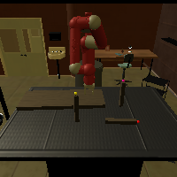
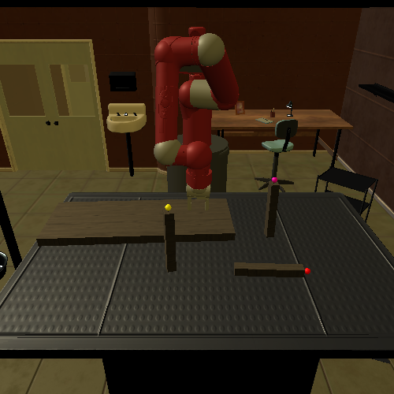
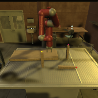
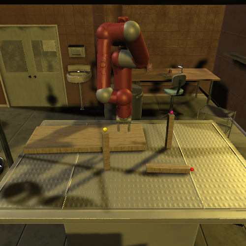

# More Information

## Rendering Quality

|||||
| :----------: | :--------: | :----------------: | :---------: |
| Low, 200x200 | Low, 500x500 | High, 200x200 | High, 500x500 |

## FPS

FPS of the environment depends on agents, control types, furniture models, and quality of rendering.
To get a high FPS, the user can adjust `control_freq`, `action_repeat`, `screen_width`, `screen_height`, `quality` (rendering quality including shadow and illumination).
We measure FPS on furniture model `table_lack_0825`, which has 5 parts, with the default configuration.
The environment can be parallelized by specifying different port numbers and each Unity instance uses around 300 MB of GPU memory.

### macOS
* Macbook Pro 15 with Intel i7 Quad-Core @ 2.7GHz and Radeon Pro 455 2GB

|   Quality    | Resolution | Sawyer (Impedance) | Sawyer (IK) | Baxter (Impedance) | Baxter (IK) | Cursor | Image |
| :----------: | :--------: | :----------------: | :---------: | :----------------: | :---------: | :----: | :---: |
| No rendering |    N/A     |        180         |     30      |        100         |     23      |  250   |  N/A  |
| Low          |  200x200   |         80         |     19      |         75         |     19      |  138   ||
| Low          |  500x500   |         61         |     17      |         60         |     16      |   92   ||
| High         |  200x200   |         44         |     14      |         32         |      8      |   80   ||
| High         |  500x500   |         34         |     13      |         26         |      7      |   69   ||

### ubuntu
* Headless server with Intel Xeon Gold 6154 72-Core @ 3.00GHz and GeForce RTX 2080 Ti

|   Quality    | Resolution | Sawyer (Impedance) | Sawyer (IK) | Baxter (Impedance) | Baxter (IK) | Cursor |
| :----------: | :--------: | :----------------: | :---------: | :----------------: | :---------: | :----: |
| No rendering |    N/A     |        225         |     44      |        158         |     28      |  491   |
| Low          |  200x200   |         65         |     26      |         54         |     17      |   95   |
| Low          |  500x500   |         52         |     24      |         45         |     17      |   65   |
| High         |  200x200   |         32         |     16      |         28         |     15      |   49   |
| High         |  500x500   |         28         |     16      |         24         |     15      |   42   |

## Troubleshooting

### Mujoco-py
* RuntimeError: Failed to initialize OpenGL

See [this link](https://github.com/openai/mujoco-py/issues/187#issuecomment-384905400).

I've found that if I want to call `env.render()` then I need to set `LD_PRELOAD` to `/usr/lib/x86_64-linux-gnu/libGLEW.so:/usr/lib/nvidia-418/libGL.so`.

However, if I want to call `env.sim.render(w, h)`, then I need to not set `LD_PRELOAD` (e.g. run `unset LD_PRELOAD`).

### Mujoco GPU rendering
To enable GPU rendering for mujoco, you need to add `/usr/lib/nvidia-000` to `LD_LIBRARY_PATH` before installing `mujoco-py`.
Then, during `mujoco-py` compilation, it will show you `linuxgpuextension` instead of `linuxcpuextension`.
In Ubuntu 18.04, you may encounter an GL-related error while building `mujoco-py`, open `venv/lib/python3.6/site-packages/mujoco_py/gl/eglshim.c` and comment line 5 `#include <GL/gl.h>` and line 7 `#include <GL/glext.h>`.

### Virtual display
If you are running on an Ubuntu server, chances are you do not have a physical monitor. Therefore, you must use a virtual display to render
images. Check out [Virtual display](installation.md#virtual-display) to see how to launch X, and specify a virtual display number with `--virtual_display` flag.

