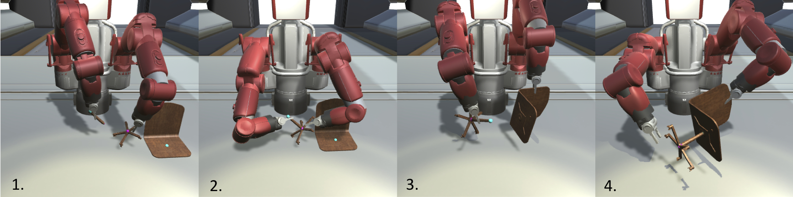
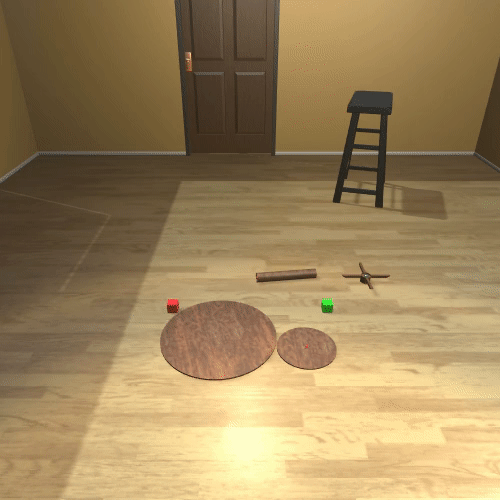
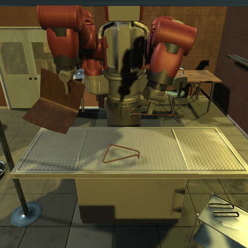
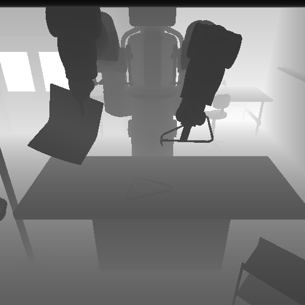
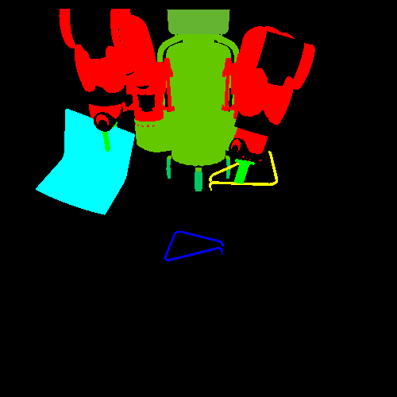

# Getting Started
After reading this, you will know:
1. How to assemble furniture
2. Control the agent with human or RL
3. Basic environment configuration
4. Code structure and key functions

## Task Description

The furniture assembly task can be defined as a cycle of part selection and attachment. As seen in the image, the robot must grip
the correct parts, and then align the connectors (colored dots). Once the connectors are correctly aligned, the robot can attach the
parts together. This process is repeated until the furniture is assembled. You can try assembling some pieces in the next section.

## Human Control Demo


```bash
$ python -m demo_manual 
```
We recommend trying the Cursor agent first to get a sense of the furniture and physics.
The Cursor, Sawyer, and Baxter share a common control scheme. In general, the control is over the movement and rotation of the hand.

- __Move:__ Q-E moves the hand up-down, W-S moves the hand forward-backward, and A-D moves the hand left-right.
- __Rotate:__ J-L, I-K, U-O keys control each axis of rotation.
- __Switch hands:__ 1 or 2 for the corresponding hand.
- __Grasp:__ The space key holds an object within the Cursor. For Sawyer and Baxter, the space key closes the grippers.
- __Attach:__ C will attach two parts together. The environment requires  multiple attach actions to fully attach the parts together.
- __Release:__ The enter (return) key releases any objects held by the Cursor. For Sawyer and Baxter, the enter key opens the grippers.
- __Screenshot:__ T key will save the screen in `furniture/camera_ob.png`.
- __Record video:__ setting flag `--record True` in the command line args will record a video.
- __Record trajectory:__ To save the current episode to a pickle file, press Y. Make sure the `--record_demo` flag is `True`. The scene will be saved in the demo directory as `test.pkl`. You can load this scene using `--load_demo`. Demonstration playback is supported through the `run_demo` function of [`furniture/env/furniture.py`](../env/furniture.py).


## Basic Usage and Configuration

The Gym-like interface makes it easy to use the environment with various RL algorithms. Moreover, users can easily switch furniture models and backgrounds using `reset` method. Please refer to [`furniture/demo_manual.py`](../env/furniture.py) for more detail.

```py
from env import make_env
from env.models import furniture_names, background_names
from config.furniture import get_default_config


# get a default arguments
config = get_default_config()

# make environment following arguments
env = make_env('FurnitureBaxterEnv', config)

# reset environment with @furniture_id and @background_name
observation = env.reset(furniture_id, background_name)

done = False
while not done:
  # sample action from policy
  action = pi.act(observation)

  # take a step
  observation, reward, done, info = env.step(action)
```

Here are some general command line configuration options.
```
'--furniture_name': str, name of furniture. Refer to furniture list in docs/configurations.md
'--furniture_id': int, ID of furniture. Refer to list below for ID furniture mappings
'--background': str, name of background scene. Refer to list below for supported scenes
'--unity': bool, use unity for rendering, otherwise use mujoco viewer
'--unity_editor' bool, use unity editor for unity
'--port': port, port for MuJoCo-Unity plugin
'--seed': int, seed for rng
'--max_episode_steps': int, maximum length (# of steps) of episode
'--screen_width': int, width of visual observation
'--screen_height': int, height of visual observation
'--camera_ids': list[int], MuJoCo camera ID
'--control_freq': int, frequency of physics simulation
'--move_speed': float, step size of movements
'--rotate_speed': float, step size of rotation
'--load_demo': string, path to a pickle file of a demonstration
'--record_demo': bool, whether to enable demonstration recording
'--demo_dir': string, path to demonstration folder
'--virtual_display': str, specify display number
```
Within each `furniture_*.py`, there are environment specific configurations in the `__init__` function. See [Configure Environments](configurations.md) for available furniture models, backgrounds, etc.

||||
| :----------: | :----------: | :----------: |
| RGB | Depth | Segmentation |

To configure the observations, use the following flags.
```
'--robot_ob': bool, whether to include agent state in ob
'--object_ob': bool, whether to include object pose in ob
'--subtask_ob': bool, whether to include subtask (part ids) in ob
'--visual_ob': bool, whether to include camera image in ob
'--depth_ob': bool, whether to include depth map in ob
'--segmentation_ob': bool, whether to include object segmentation in ob
```
## RL Training

Train block picking up with the provided a SAC implementation. It requires 300k steps to pick up a block.
```bash
# gpu: gpu number
python -m rl.main --env FurnitureBaxterBlockEnv --prefix demo --gpu 0 --reward_scale 3
```
See the [`furniture/rl`](../rl) folder for a full SAC implementation that uses the IKEA furniture assembly environment.
* [`furniture/rl/main.py`](../rl/main.py): sets up log directories and launches a trainer.
* [`furniture/rl/trainer.py`](../rl/trainer.py): creates IKEA furniture assembly environment and trains an agent.
* [`furniture/rl/rollouts.py`](../rl/rollouts.py): collects rollouts given an environment and an agent.

### Gym interface
Gym interface for the IKEA Furniture Assembly environment is also provided in [`furniture/env/furniture_gym.py`](../env/furniture_gym.py), but the furniture model and background should be predefined when registered (see [`furniture/env/__init__.py`](../env/__init__.py).
```py
import gym

# make environment
env = gym.make('furniture-baxter-v0')

# reset environment
observation = env.reset()

done = False
while not done:
  # take a step
  observation, reward, done, info = env.step(env.action_space.sample())
```

### Parallel Execution
See [`demo_gym.py`](../demo_gym.py) for parallel execution of our environment.

## Code Structure
The structure of the repository:
* `env`: Environment code for simulated experiments
* `furniture-unity`: Unity project
* `config`: Argument parser
* `util`: Utility functions including logger
* `rl`: Code for RL (SAC and PPO)
* `docs`: Project website and docs

### env folder
This folder contains the python code for environment scripting. We use many files and functions from the [Robosuite environment](https://github.com/StanfordVL/robosuite). The main files and folders are:

#### furniture.py
This is the base environment. It contains functionality for interfacing with the MuJoCo simulation and Unity Renderer.
Some functions of interest are:
* `step(action)`: Environmental step function used for RL training.
* `render(mode)`: Gets RGB images, segmentation map, depth maps, from the simulation.
* `_is_aligned(a,b)`: Checks if two connectors are aligned. You can adjust threshold to decide connection of two parts
* `_connect(a,b)`: Connects the given two connectors using a weld constraint.

#### Agent-specific files
The next files all extend [`furniture/env/furniture.py`](../env/furniture.py) with agent-specific logic.
- [`furniture/env/furniture_cursor.py`](../env/furniture_cursor.py)
- [`furniture/env/furniture_sawyer.py`](../env/furniture_sawyer.py)
- [`furniture/env/furniture_baxter.py`](../env/furniture_baxter.py)

These agents override `observation_space`, `dof`, `get_obs`, and `_step`.


#### models folder
Code for robots, MuJoCo XML objects, and initialization code can be found in the respective folders.
The furniture XMLs can be found in [`furniture/env/models/assets/objects`](../env/models/assets/objects).
More documentation on the XML schema can be found in the XML documentation.


### furniture-unity folder
This folder is a Unity3d project. You can open it using the Unity Editor to change lighting, backgrounds, and textures.
The code is implemented on top of [DoorGym-Unity](tttps://github.com/PSVL/DoorGym-Unity).


### rl folder
This folder contains an SAC implementation that learns to pick up a furniture part.
